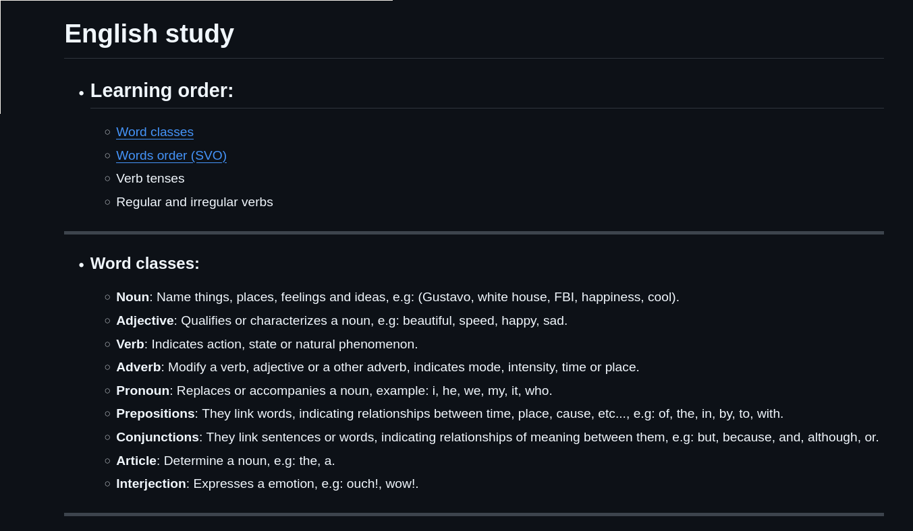
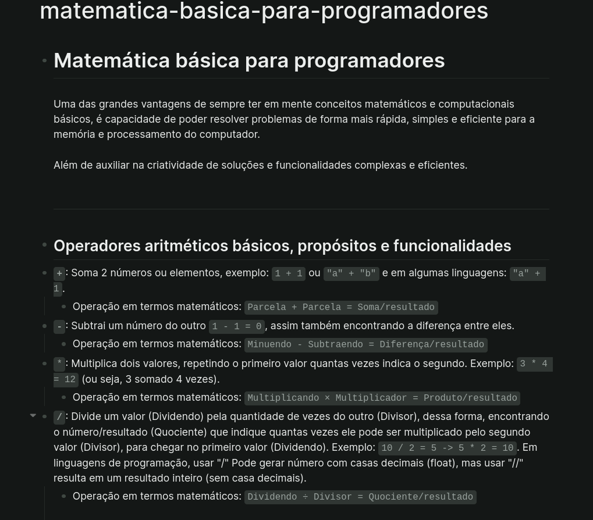
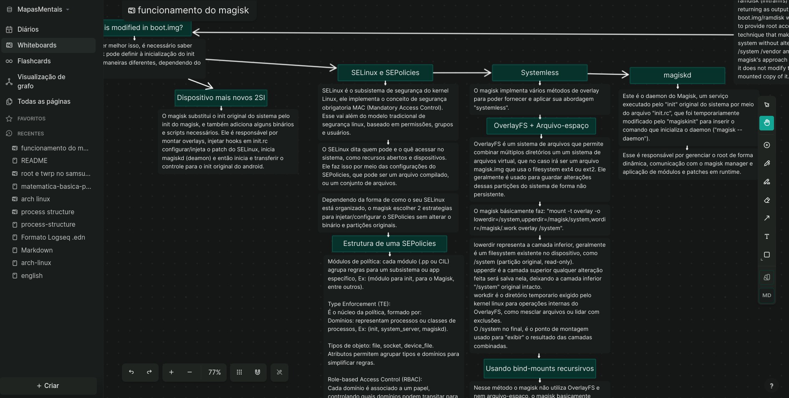
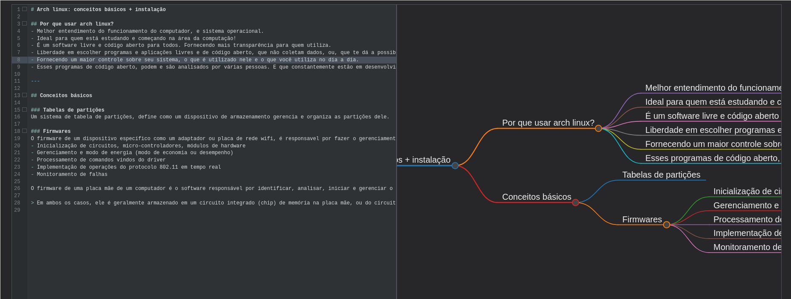

# Mapas mentais

## Índice
- [Estrutura de processos do Linux](#estrutura-de-processos-criação-e-funcionamento)

---

## Visualize pelo github

## Markdown em Logseq

## Mapas mentais .edn no Logseq

---

## Instruções de uso

### Como abrir os mapas mentais .edn?
1. [Instalar Logseq](https://logseq.com/)
2. Baixar o arquivo .edn
3. Importar o arquivo .edn diretamente pela interface do Logseq, ou mover ele para a pasta **whiteboards** do Logseq ou a pasta correta usada.
4. Para mais detalhes consulte a documentação oficial **[Documentação Logseq](https://github.com/logseq/logseq)**

### Arquivos markdown podem ser visualizados em formato de mapa mental, por meio de sites como [markmap](https://markmap.js.org/repl)

---

### Estrutura de processos, criação e funcionamento
- [Formato markdown](markdowns/process-structure.md)
- [Formato Logseq .edn](whiteboards/process-structure.md)

