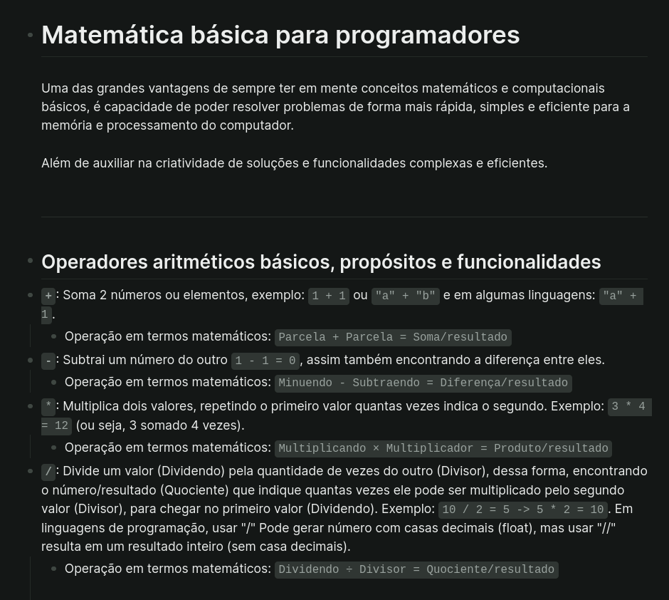

# Mapas mentais

## Índice
- [Estrutura de processos do Linux](#estrutura-de-processos-criação-e-funcionamento)

---

### Visualize pelo github

### Markdown em Logseq

### Mapas mentais .edn no Logseq

---

## Instruções de uso

### Como abrir os mapas mentais .edn?
1. [Instalar Logseq](https://logseq.com/)
2. Baixar o arquivo .edn
3. Importar o arquivo .edn diretamente pela interface do Logseq, ou mover ele para a pasta **whiteboards** do Logseq ou a pasta correta usada.
4. Para mais detalhes consulte a documentação oficial **[Documentação Logseq](https://github.com/logseq/logseq)**

### Arquivos markdown podem ser visualizados em formato de mapa mental, por meio de sites como [markmap](https://markmap.js.org/repl)

---

## Arch Linux
- [Formato markdown](markdowns/arch-linux.md)
- [Formato Logseq .edn](whiteboards/archlinux.edn)

## Ataques a redes Wi-Fi
- [Formato markdown](markdowns/ataques-redes-wifi.md)
- [Formato Logseq .edn](whiteboards/ataques-redes-wifi.edn)

## Como a CPU armazena dados na RAM
- [Formato markdown](markdowns/como-a-CPU-armazena-dados-na-RAM.md)
- [Formato Logseq .edn](whiteboards/como-a-CPU-armazena-dados-na-RAM.edn)

## Como funciona um terminal e como a CPU executa instruções
- [Formato markdown](markdowns/como-funciona-um-terminal-e-como-a-CPU-executa-instruçoes.md)
- [Formato Logseq .edn](whiteboards/como-funciona-um-terminal-e-como-a-CPU-executa-instruçoes.edn)

## Compiladores, montadores, arquivos objeto, linkers e executáveis
- [Formato markdown](markdowns/compiladores-montadores-arquivos-objeto-linkers-e-executaveis.md)
- [Formato Logseq .edn](whiteboards/compiladores-montadores-arquivos-objeto-linkers-e-executaveis.edn)

## Estrutura geral e funcionamento do sistema Android
- [Formato markdown](markdowns/estrutura-geral-funcionamento-sistema-android.md)
- [Formato Logseq .edn](whiteboards/estrutura-geral-funcionamento-sistema-android.edn)

## Funcionamento do Magisk
- [Formato markdown](markdowns/funcionamento-do-magisk.md)
- [Formato Logseq .edn](whiteboards/funcionamento-do-magisk.edn)

## Funcionamento dos gerenciadores de pacotes Portage e Pacman
- [Formato markdown](markdowns/funcionamento-dos-gerenciadores-de-pacotes-portage-e-pacman.md)
- [Formato Logseq .edn](whiteboards/funcionamento-dos-gerenciadores-de-pacotes-portage-e-pacman.edn)

## Matemática básica para programadores
- [Formato markdown](markdowns/matematica-basica-para-programadores.md)

## Princípios de segurança da informação
- [Formato markdown](markdowns/principios-segurança-da-informação.md)

## Estrutura de processos, criação e funcionamento
- [Formato markdown](markdowns/process-structure.md)
- [Formato Logseq .edn](whiteboards/process-structure.edn)

## Roadmap de hacking
- [Formato markdown](markdowns/roadmap-hacking.md)
- [Formato Logseq .edn](whiteboards/roadmap-hacking.edn)

## Root e TWRP em dispositivos Samsung
- [Formato markdown](markdowns/root-twrp-samsung.md)
- [Formato Logseq .edn](whiteboards/root-twrp-samsung.edn)

## English notes
- [Formato markdown](markdowns/english.md)
