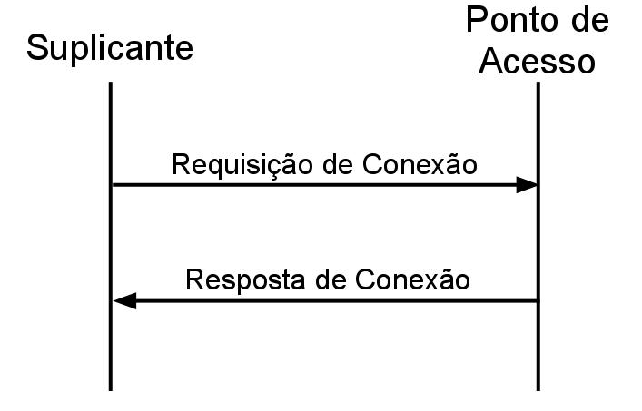
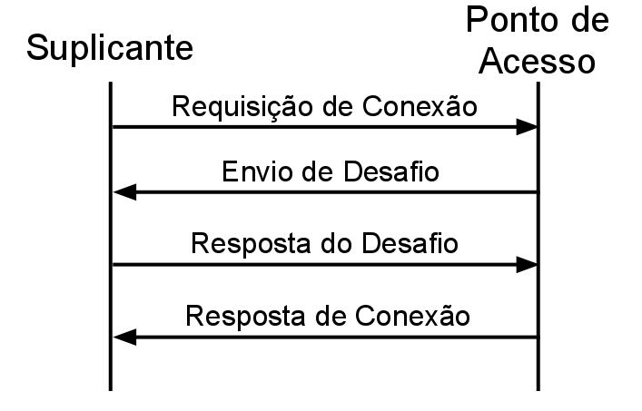
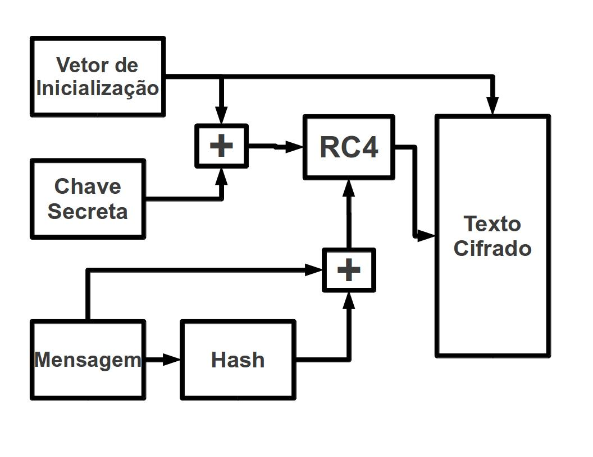
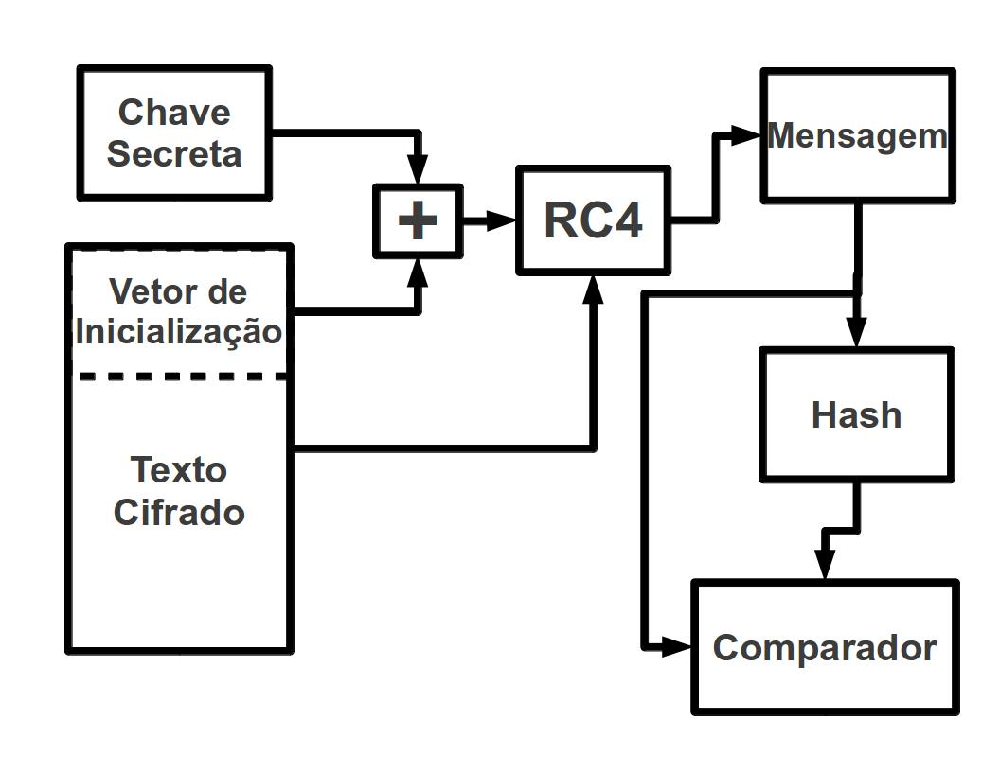
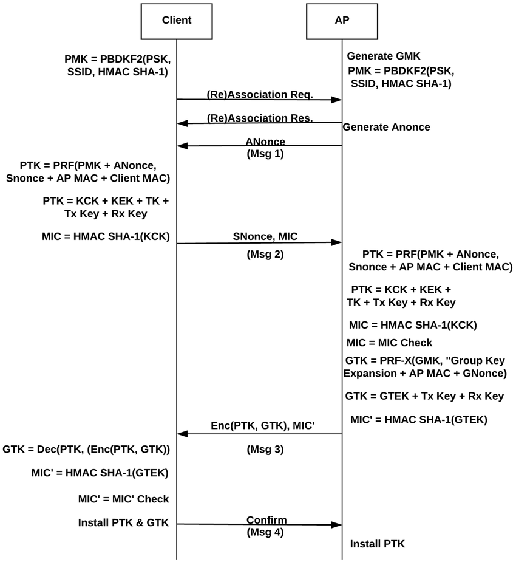
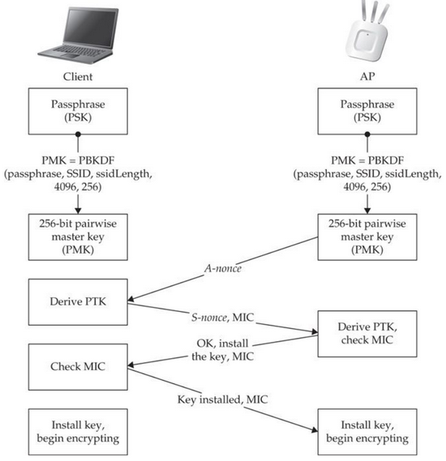
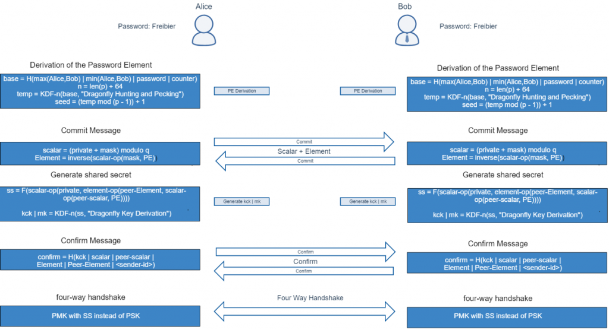
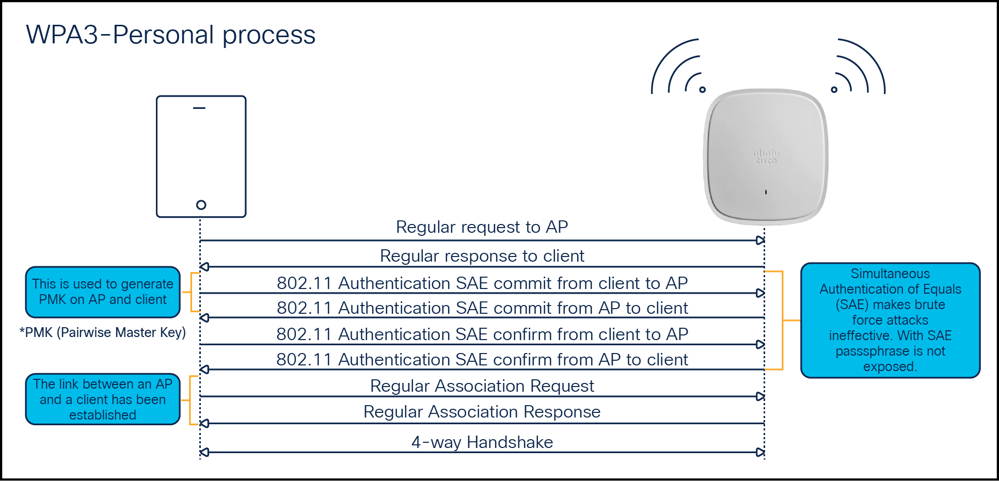

# Principais ataques a redes Wi-Fi
## Pré-requisitos
### Leia e tenha em mente os conceitos básicos sobre redes de computadores, arquitetura e funcionamento geral
- [Conceitos fundamentais do funcionamento das comunicações sem fio](https://cyberspace-bnw.pages.dev/blogs/contents/como-funcionam-as-comunica%C3%A7oes-sem-fio)
- [Modelo OSI e TCP/IP, e os principais protocolos usados em cada camada](../assets/osi-tcp-models.png)

---

## WEP (Wired Equivalent Privacy)

### Funcionamento básico

| **Autênticação Open-System**                              | **Autênticação Shered Key**                             |
|-----------------------------------------------------------|---------------------------------------------------------|
| | |

| Encriptação WEP                                 | Decriptação WEP                                  |
|-------------------------------------------------|--------------------------------------------------|
|| |

### Principais ataques
- **FMS (Fluhrer–Mantin–Shamir)**
  - Criptoanálise passiva de RC4 que, após captura de pacotes suficientes, recupera a chave WEP em minutos.
- **PTW (Pyshkin–Tews–Weinmann)**
  - Otimização do FMS que reduz ainda mais o número de IVs necessários para recuperar a chave.
- **KoreK attacks**: 
  - variantes que exploram padrões de IV fracos para acelerar a quebra de RC4.  
- **ARP Injection**
  - injeção ativa de pacotes ARP para forçar o AP a gerar IVs adicionais, acelerando a coleta de dados.
- **Chop-Chop**
  - Manipulação de frames WEP para fragmentar e recuar bytes, permitindo descriptografar e forjar pacotes byte a byte.
- **Fragmentation attack**
  - Aproveita a fragmentação de 802.11 para recuperar partes do RC4 keystream e reconstruir a chave.
- **Caffe Latte**
  - Ataque remoto contra clientes Windows vulneráveis, abusando da autenticação por Shared Key para extrair a chave WEP sem estar no mesmo SSID.

---

## WPA/WPA2-Personal

### Funcionamento básico
| **4-Way handshake WPA/WPA2-Personal**        | **Processo simplificado**                              |
|----------------------------------------------|--------------------------------------------------------|
|||

- **Handshake de 4 vias**:
  - **Mensagem 1** (AP => STA)
    - AP envia um *ANonce* (número aleatório gerado pelo AP).
   
  - **Mensagem 2** (STA => AP):
    - O cliente gera seu próprio *SNonce*.
    - Cliente calcula a PMK (Pairwise Master Key): `PMK = PBKDF2(HMAC_SHA1, passphrase, SSID, 4096, 256)`
    - Com a PMK, ANonce, SNonce, MAC do AP e do cliente, ele calcula o PTK (Pairwise Transit Key): `PTK = PRF(PMK, "Pairwise key expansion", Min(AP_MAC, STA_MAC) || Max(AP_MAC, STA_MAC) || Min(ANonce, SNonce) || Max(ANonce, SNonce))`
    - Em seguida, envia o *SNonce* e um MIC (Message Integrity Code) da mensagem 2, calculado com a chave KCK (Key Confirmation Key) extraída do PTK.
    - `MIC = HMAC-SHA1(KCK, dados_da_mensagem)`
    - `KCK = Primeiros 128 bits da PTK.`
    - KEK (Key Encryption Key) = Próximos 128 bits.
    - TK (Temporal Key) = Restante 128 bits para TKIP, 256 bits para CCMP (Counter Mode CBC-MAC Protocol).
   
  - **Mensagem 3** (AP => STA):
    - O AP calcula o mesmo PTK, valida o MIC da mensagem 2.
    - Envia a GTK (Group Temporal Key) criptografada com a KEK (Key Encryption Key), também derivada do PTK.
    - `GTK = PRF-X(GMK,"Group key expansion",AA+GN+GNonce)`, A GMK é gerada aleatóriamente pelo AP.
   
  - **Mensagem 4** (STA => AP):
    - O cliente confirma a instalação das chaves enviando o último MIC.
    - O AP verifica e confirma, e finaliza o handshake (Ele não envia nenhuma mensagem nesse caso).

### Principais ataques
- **Ataque de dicionário offline em WPA2-PSK usando handshake de 4 vias e verificação de MIC**
  - O atacante captura os pacotes EAPOL do 4-way handshake de alguma vítima, e então usa os dados deles + uma wordlist para tenta gerar um MIC com coincida com o MIC do pacote EAPOL.
- **PMKID attack**
  - Extrai o PMKID diretamente do handshake de associação (hash no beacon), sem necessidade de 4-vias completo. 
- **KRACK (Key Reinstallation Attack)**
  - Força a reinstalação de chaves ao repetir mensagens do handshake, permitindo descriptografar e falsificar pacotes.
- **Evil Twin**
  - Criação de ponto de acesso falso (SSID idêntico) para capturar credenciais WPA/WPA2 de clientes que se reconectam automaticamente.
- **Hole196 (GTK-Theft)**
  - Explora o Group Temporal Key compartilhado para injeção de pacotes e MITM, assumindo que o atacante já esteja autenticado.
- **Predictable GTK**
  - Falhas no RNG de alguns drivers que permitem prever a GTK, viabilizando injeção de tráfego.
- **WPS PIN brute‑force**
  - Desbloqueio da senha WPA/WPA2 através da força bruta do PIN WPS (8 dígitos) em horas.
- **Deauthentication & DoS**
  - Ataques de desautenticação/disassociação flooding, derrubando clientes ou capturando reautenticações.

---

## WPA3-Personal

### Funcionamento básico
| **SAE (Simultaneous Authentication of Equals) 4-Way handshake WPA3-Personal** | **Processo simplificado**|
|----------------------------------------------|--------------------------------|--------------------------|
|             |                       |

### Principais ataques
- **Dragonblood (Side-Channel & Downgrade)**
  - Conjunto de ataques ao handshake SAE que explora vazamento de tempo e downgrade em modo de transição
- **Downgrade to WPA2**
  - Em redes configuradas em modo misto, forçar clientes a usar WPA2 (mais vulnerável).
- **Cache-side-channel (CVE-2019-9495 / 9497)**
  - Ataques de canal lateral contra implementações de EAPPWD em hostapd/wpa_supplicant.

---

## Mitigações e configurações recomendadas

- **Desabilitar WEP completamente**, não apenas desative, remova qualquer opção de WEP no roteador.
- **Usar WPA2‑PSK (ou WPA3‑Personal) com AES‑CCMP somente**, desative TKIP e todas as cifras obsoletas. 
- **Desabilitar WPS (PIN e PBC)**, se não for possível, ao menos use somente Wi-Fi Easy Connect (DPP).
- **Habilitar Management Frame Protection (802.11w)** para proteger contra ataques de desautenticação/disassociation.
- **Desabilitar “modo de transição” ou “mixed mode”** em WPA3, use apenas WPA3-Personal (SAE) para evitar downgrades.
- **Escolher senhas fortes**! (20+ caracteres, misturando maiúsculas, minúsculas e símbolos) e evitar palavras do dicionário.  
- **Atualizar firmware** do roteador regularmente para corrigir vulnerabilidades conhecidas.
- **Ocultar SSID** e usar isolação de cliente (“AP isolation”) para reduzir vetores de scan passivo e MITM.
- **Monitorar regularmante logs de segurança** do roteador para tentativas anômalas de autenticação ou flood.

---

## Indíces para créditos
### [WEP](#wep-wired-equivalent-privacy)
> Créditos as imagens: [WEP](https://www.gta.ufrj.br/ensino/eel879/trabalhos_vf_2011_2/rodrigo_paim/wep.html)
Veja mais em [WEP Wikipedia](https://pt.wikipedia.org/wiki/Wired_Equivalent_Privacy)

### [WPA/WPA2-Personal](#wpawpa2-personal)
> Créditos as imagens: [WPA/WPA2 4-way handshake](https://www.researchgate.net/publication/328632250/figure/fig1/AS:11431281414288789@1746014898884/A-detailed-diagram-of-the-four-way-handshake-Msg-Message.tif) [Processo simplificado](https://duckduckgo.com/?t=ffab&q=WPA%2FWPA2-Personal+handshake&ia=images&iax=images&iai=https%3A%2F%2Fraw.githubusercontent.com%2Fkoutto%2Fpi-pwnbox-rogueap%2Fmain%2Fimg%2Fwpa-psk-authentication-4way-handshake.png)
Veja mais em [WPA Wikipedia](https://en.wikipedia.org/wiki/Wi-Fi_Protected_Access)

### [WPA3-Personal](#wpa3-personal)
> Créditos as imagens: [WPA3 Handshake](https://blog.compass-security.com/wp-content/uploads/2019/07/image-4-1024x556.png) [WPA3 Autenticação](https://www.cisco.com/c/dam/en/us/products/collateral/wireless/catalyst-9100ax-access-points/wpa3-dep-guide-og.docx/_jcr_content/renditions/wpa3-dep-guide-og_15.png)
Veja mais em [WPA Wikipedia](https://en.wikipedia.org/wiki/Wi-Fi_Protected_Access)
